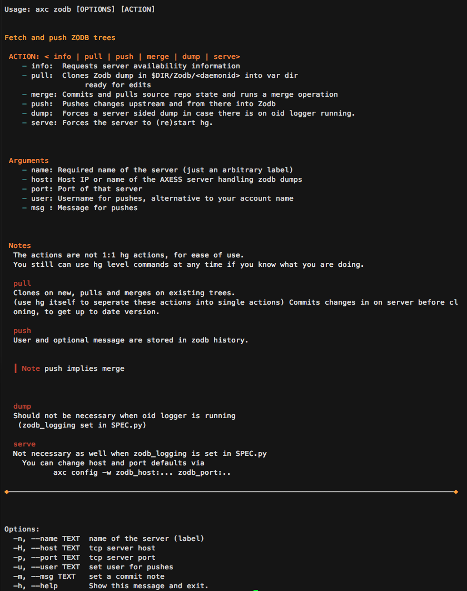
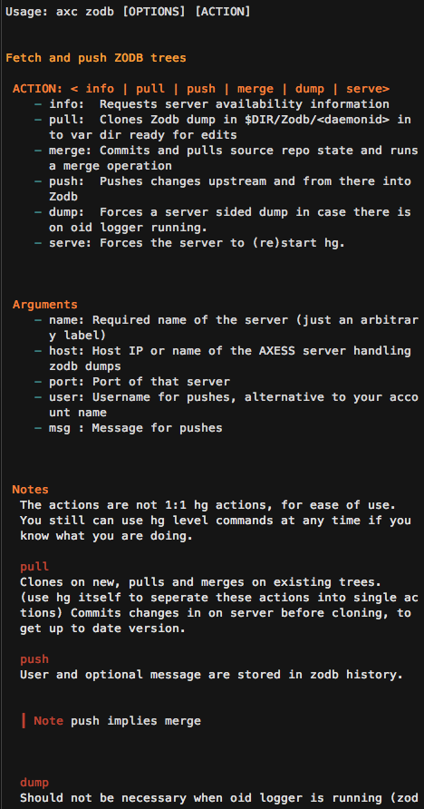

# Terminal Markdown Viewer

*When you edit multiple md files remotely, like in a larger [mkdocs](http://www.mkdocs.org/) project, context switches between editing terminal(s) and viewing browser may have some efficiency impact. Also sometimes there is just no browser, like via security gateways offering just a fixed set of applications on the hop in machine. Further, reading efficiency and convenience is often significantly improved by using colors. And lastly, using such a thing for cli applications might improve user output, e.g. for help texts. This is where mdv, a Python based mark down viewer for the terminal might be a good option.*

Markdown is "simple" enough to be well displayed on modern (256 color) terminals (except images that is).


from 

	### Source
	# Header 1
	## Header 2
	### Header 3
	#### Header 4
	##### Header 5
	###### Header 6
	```python
	""" Test """
	# Make Py2 >>> Py3:
	import os, sys; reload(sys); sys.setdefaultencoding('utf-8')
	# no? see http://stackoverflow.com/a/29832646/4583360 ...
	
	# code analysis for hilite:
	try:
	    from pygments import lex, token
	    from pygments.lexers import get_lexer_by_name, guess_lexer
	```
	
	| Tables | Fmt |
	| -- | -- |
	| !!! hint: wrapped | 0.1 **strong** |
	    
	!!! note: title
	    this is a Note

----

> mdv is a weekend hack and in a pre-release/proof of concept state: While for simple structures it does its job quite well, it still requires optimizations and testing regarding its output, for more complex markdown. Guess I'll invest another weekend soon.

----

### Noteable Features

- 40k theme combinations: mdv ships with > 200 luminocity sorted themes, converted from html themes tables to ansi. Those can be combined for code vs regular md output...
- Admonitions
- Tables, incl. wide table handling avoiding "interleaving"
- Somewhat hackable, all in [one](mdv.py) module
- Useable as lib as well
- File change monitor
- Smart text wrapping
- Little directory change monitor (cames handy when working on multiple files, to get the current one always displayed)
	- which can run arbitrary commands on file changes
	- which passes filepath, raw and prettyfied content to the other command
        Note: Poor man's implementation, polling. Check inotify based tools if you want sth better.

## Alternatives

The ones I know of (and which made me write mdv ;-) ):

1. There are quite a few from the js community (e.g. [msee](https://www.npmjs.com/package/msee), ansidown, ansimd and also nd which is great) but they require nodejs & npm, which I don't have on my servers. Also I personally wanted table handling and admonition support throughout and prob. too old to hack other peoples' js (struggling enough with my own). But have a look at them, they do some things better than mdv in this early version (I try to learn from them). Also [this](https://github.com/substack/picture-tube) would be worth a look ;-)

2. pandoc -> html -> elinks, lynx or pandoc -> groff -> man. (Heavy and hard to use from within other programs. Styling suboptimal)

3. vimcat (Also heavy and hard to use inline in other programs)

Summary: For production ready robust markdown viewing (e.g. for your customers) I recommend nd still, due to the early state of mdv. For playing around, especially with theming or when with Python, this one might be a valid alternative to look at.

## Installation

Manual, no package. I.e.:

	alias mdv='<path to this repo>/mdv.py # within your .bashrc or .zshrc or
	ln -s <path to this repo>/mdv.py ./bin/mdv # within your $PATH

No pip currently.

### Requirements
 
- python2.7
- py markdown (pip install markdown)
- this repo

Further a 256 color terminal (for now best with dark background) and font support for a few special separator characters (which you could change in mdv.py).

> For light terms you'd just need to revert the 5 colors from the themes, since they are sorted by luminocity.

Further I did not test anything on windows.

## Usage

### CLI

```markdown
Usage:
    mdv [-t THEME] [-T C_THEME] [-x] [-l] [-L] [-c COLS] [-f FROM] [-m] [-M DIR] [-H] [-A] [MDFILE]

Options:
    MDFILE    : Path to markdown file
    -t THEME  : Key within the color ansi_table.json. 'random' accepted.
    -T C_THEME: Theme for code highlight. If not set: Use THEME.
    -l        : Light background (not yet supported)
    -L        : Display links
    -x        : Do not try guess code lexer (guessing is a bit slow)
    -f FROM   : Display FROM given substring of the file.
    -m        : Monitor file for changes and redisplay FROM given substring
    -M DIR    : Monitor directory for markdown file changes
    -c COLS   : Fix columns to this (default: your terminal width)
    -A        : Strip all ansi (no colors then)
    -H        : Print html version

Notes:

    We use stty tool to derive terminal size.

    To use mdv.py as lib:
        Call the main function with markdown string at hand to get a
        formatted one back.

    FROM:
        FROM may contain max lines to display, seperated by colon.
        Example:
        -f 'Some Head:10' -> displays 10 lines after 'Some Head'
        If the substring is not found we set it to the *first* charactor of the
        file - resulting in output from the top (if you terminal height can be
        derived correctly through the stty cmd).

    File Monitor:
        If FROM is not found we display the whole file.

    Directory Monitor:
        We check only text file changes, monitoring their size.

        By default .md, .mdown, .markdown files are checked but you can change
        like -M 'mydir:py,c,md,' where the last empty substrings makes mdv also
        monitor any file w/o extension (like 'README').

        Running actions on changes:
        If you append to -M a '::<cmd>' we run the command on any change
        detected (sync, in foreground).
        The command can contain placeholders:
            _fp_    : Will be replaced with filepath
            _raw_   : Will be replaced with the base64 encoded raw content
                      of the file
            _pretty_: Will be replaced with the base64 encoded prettyfied output

        Like: mdv -M './mydocs:py,md::open "_fp_"'  which calls the open
        command with argument the path to the changed file.


    Theme rollers:
        mdv -T all:  All available code styles on the given file.
        mdv -t all:  All available md   styles on the given file.
                    If file is not given we use a short sample file.

        So to see all code hilite variations with a given theme:
            Say C_THEME = all and fix THEME
        Setting both to all will probably spin your beach ball, at least on OSX.


```

*who knows of a docopt to markdown feature ;-)*?

> Regarding the strange theme ids: Those numbers are the calculated total luminocity of the 5 theme colors.

### Inline

mdv is designed to be used well from other (Py2) programs when they have md at hand which should be displayed to the user:

```python
import mdv

# config like this:
mdv.term_columns = 60

# calling like this
formatted = mdv.main(my_raw_markdown, c_theme=...)  # all CLI options supported
```

> Note that I set the defaultencoding to utf-8  in ``__main__``. I have this as my default python2 setup and did not test inline usage w/o. Check [this](http://stackoverflow.com/a/29832646/4583360) for risks.
	
### Sample Inline Use Case: click module docu

Armin Ronacher's [click](http://click.pocoo.org) is a great framework for writing larger CLI apps - but its help texts are a bit boring, intended to be customized.

Here is how:

Write a normal click module with a function but w/o a doc string as shown:
```python
@pass_context                                                                   
 def cli(ctx, action, name, host, port, user, msg):           
	""" docu from module __doc__ """
```

On module level you provide markdown for it, like:

```shell
~/axc/plugins/zodb_sub $ cat zodb.py | head 
"""
# Fetch and push ZODB trees

## ACTION: < info | pull | push | merge | dump | serve>

- info:  Requests server availability information
(...)
```
which you set at click module import time:

	mod.cli.help = mod.__doc__
	

Lastly do this in your app module:

```python
from click.formatting import HelpFormatter
def write_text(self, text):
    """ since markdown pretty out on cli I found no good tool I built my own """
    # poor man's md detection:
    if not text.strip().startswith('#'):
        return orig_write_text(self, text)
    from axc.markdown.mdv import main as mdv
    self.buffer.append(mdv(md=text, theme=os.environ['AXC_THEME']))  # supply a theme ID or get random

HelpFormatter.orig_write_text = HelpFormatter.write_text    
HelpFormatter.write_text = write_text
```

The output has then colors:



and at smaller terms rewraps nicely:



Further, having markdown in the module ``__doc__`` makes it simple to add into a global project docu framework, like mkdocs.	
	
	
	
#### Customization

In [mdv.py](mdv.py) you can change some config straight forward.

```python
# ---------------------------------------------------------------------- Config
txt_block_cut, code_pref, list_pref, br_ends = '✂', '░ ', '- ', '◈'
# ansi cols (default):
# R: Red (warnings), L: low visi, BG: background, BGL: background light, C=code
# H1 - H5 = the theme, the numbers are the ansi color codes:
H1,  H2,  H3,  H4,  H5, R,   L,  BG, BGL, T,   TL, C   = \
231, 153, 117, 109, 65, 124, 59, 16, 188, 188, 59, 102
# Code (C is fallback if we have no lexer). Default: Same theme:
CH1, CH2, CH3, CH4, CH5 = H1, H2, H3, H4, H5

code_hl = { "Keyword" : 'CH3', "Name" : 'CH1',
            "Comment" : 'L',  "String": 'CH4',
            "Error"   : 'R',  "Number": 'CH4',
            "Operator": 'CH5',
            "Generic" : 'CH2'
            }

admons = {'note'     : 'H3', 'warning': 'R',
          'attention': 'H1', 'hint'   : 'H4',
          'summary'  : 'H1', 'hint'   : 'H4',
          'question' : 'H5', 'danger' : 'R',
          'caution'  : 'H2'
         }

def_lexer = 'python'
guess_lexer = True
# also global. but not in use, BG handling can get pretty involved, to do with
# taste, since we don't know the term backg....:
background = BG

# normal text color:
color = T

show_links = None

# columns(!) - may be set to smaller width:
try:
    term_rows, term_columns = os.popen('stty size', 'r').read().split()
    term_columns = int(term_columns)
except:
    print '!! Could not derive your terminal width !!'
    term_columns = 80

# could be given, otherwise read from ansi_tables.json:
themes = {}


# sample for the theme roller feature:
md_sample = ''

# ------------------------------------------------------------------ End Config
```

Any importing module can overwrite those module global variables as well.

Should you need yet additional themes, add them to ``ansi_tables.json`` file by adding your ansi codes there.


## Screenshots

Random results, using the theme roller feature:


Note the table block splitting when the table does not fit (last picture).

## TODO

- Refactor the implementation, using a config class
- Lines separators not optimal ([nd](https://www.npmjs.com/package/nd) does better)
- Some inline tags shown as html (nested lis)
- Test light colorscheme
- Dimming
- A few grey scale and 8 color themes
- Sorting of the json by luminance
- Some themes have black as darkest color, change to dark grey


# Credits

[pygments](http://pygments.org/) (using their lexer)

[tabulate](https://pypi.python.org/pypi/tabulate)

and, naturally, the [python markdown project](https://pythonhosted.org/Markdown/authors.html)


### Lastly

*sorry for the aggressive promotion of setdefaultencoding in the example shot, hope it does not hurt anybody's feelings;-) I'm only on posix and don't deal with last century encodings. Py2's text handling with it just rocks.*
